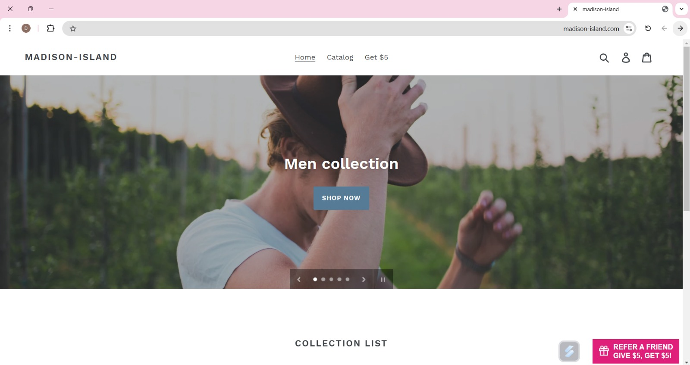
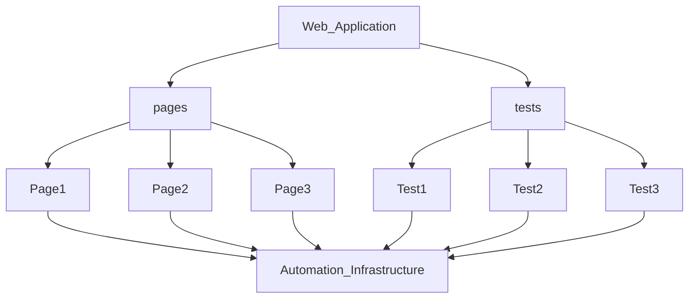

<h1> 💯	Madison-Island Aautomation Project</h1>
This is my first automation project with Java and Selenium using eclipse, for shopping demo site: https://madison-island.com/ <br>
<!--Further details can be found on the following website: __  -->

<h2> 🔍 Overview </h2>
I implemented the Page Object Model (POM) design pattern by organizing the project into 'Page' and 'Test' classes, where each web page is represented by its own corresponding class. <br>
Additionally, I designed the methods to be reusable and flexible, ensuring they can easily accommodate new features as the application evolves. <br>
<br>
<p align="center">

</p>
<h2>💻 Technologies </h2>
<p>☕<b>Java:</b> A versatile, object-oriented programming language known for portability and a vast ecosystem, ideal for web, mobile, and enterprise applications.<br></p>
<p>💽<b>Selenium:</b> An open-source tool for automating web browsers, supporting multiple languages to test web applications.<br></p>
<p>🧰<b>TestNG:</b> A Java testing framework offering features like parallel execution and data-driven testing for large-scale test automation.<br></p>
<p>🌳<b>Git:</b> A distributed version control system for tracking code changes and enabling collaboration among developers.<br></p>
<p>🛠️<b>Maven:</b> A build automation tool for managing Java project dependencies, structure, and the build lifecycle.<br></p>
<!--<p>📊<b>Allure:</b> A test reporting framework that integrates with tools like TestNG to generate detailed, dynamic HTML reports.<br></p> -->
<!--<p>🤖<b>Jenkins:</b> An open-source automation server for continuous integration and delivery (CI/CD), supporting various tool integrations.<br></p> -->
<br>

<!--<h2>:🎥  Demo </h2>
 -->

<!--<h2>📊 Reports </h2>
 -->

<!-- <h2>📖 User Guide </h2>
Please review this file: https://docs.google.com/document/d/1krdPGVB7Q1rza0lzCrx5gbg1yLOrP-CuVnI-RYg-5f0/edit?usp=sharing
ads the file to GitHub
 -->
 

<h2>📂 Project Structure</h2> 

```
├───.settings
├───src
│   ├───main
│     ├───java
│     └───resources
│   └───test
│     ├───java
│         ├───pages
│         ├───tests
│         └───utils
│     └───resources
│        └───data
├───target
│    ├───classes
│        └───META_INF
│            └───maven
│    └───test-classes
│        ├───data
│        ├───pages
│        ├───tests
│        └───utils        

  ```

<h2>🌱 Page Object Model</h2> 



<h2>☝️ Recommendations</h2>
<ol>
<li> Add a "Back" button on the 'item page' when browsing the Catalog.
<li> After adding an item to the cart, a pop-up should prompt the user with options to either "Continue Shopping" or "Go to Cart".
<li> Standardize the capitalization of item titles for consistency.
<li> Add a "Continue Shopping" option on the checkout page.
<li> The "Continue Shopping" button on the cart page should redirect to the page the user originated from.
<li> Limit the maximum quantity of a cart item to 10.
<li> Standardize the "BED & BATH" filter option in both the Catalog and Home & Decor sections.
<li> Remove duplicate filters from the Women, Men, Accessories, and Home & Decor categories (e.g., "All Products," page names such as "Women", "Men", "Accessories", and "Home & Decor").
<li> Add a "New Arrivals" filter to the Accessories and Home & Decor sections.
</ol>

<h2>📞 Contact</h2>
Thanks for taking the time to explore my GitHub!<br>
For any questions or feedback, feel free to contact me at: <br>
📧 <b>danielleamano01@gmail.com </b><br> 
<br>


[Back to top](#top)
